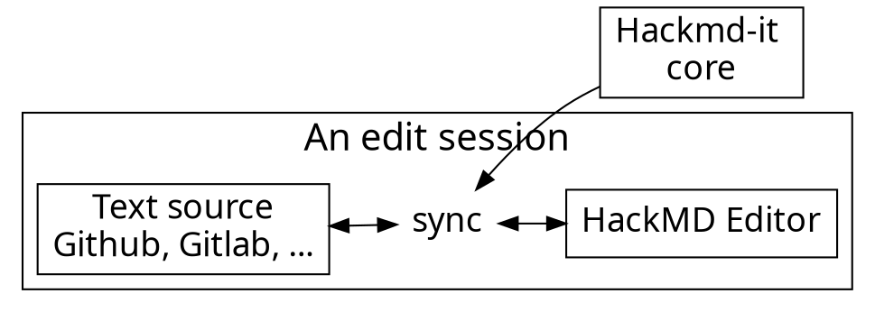

# Data Speaks Louder than Words

<!-- Put the link to this slide here so people can follow -->
## DS-100
slide: https://hackmd.io/p/template-Talk-slide

---

We have a collaborative session

please prepare laptop or smartphone to join!

---

## Who am I?

- 15 year software consultant
- ~8 years at Red Hat
- 3 years as Spark! Engineer (Expert) in Residence

---

## What is Data Science?

Preparing and understanding data using mathematics and software,

We all have a tendency to "estimate" or "go with a gut feel" when presented with large amounts of information.
However, when we do that, we are often wrong, especially as the amount of data increases.
The amount of data is increasing ridiculously quickly.
As a result, we created this class, to try to help people from any background and with any goal to better leverage data.

---

## What's a lot of data?

First, let's get some context.

| Name | Size | Example |
| ---- | ---- | ------- |
| bit  | bit     | on/off or true/false |
| byte | 8 bits  | one character (e.g. letter, number) |
| kilobyte  | kB | 1,000 bytes  | 200 word essay* |
| kilobit  | Kb | 1,024 bits  | 200 word essay* |
| kilobyte  | KB | 1,024 bytes  | 200 word essay* |
| megabyte  | mB | 1 million bytes  | 1 minute of music |
| megabit  | Mb | 1,024 Kb  | 1 minute of music |
| megabyte  | MB | 1,024 KB  | 1 minute of music |

Note:
Computers are based on 0s and 1s, so we always count by 2.
In other words, they use "base 2".
"200 word essay" -- an example of bad estimates: words in english? words in typical writing?
Much like hacker vs cracker, kibi and mibi haven't really taken off

---

| Name | Size | Example |
| ---- | ---- | ------- |
| gigabyte  | gB | 1,000 mb  | 230 songs |
| gigabit  | Gb | 1,024 Mb  | 230 songs |
| gigabyte  | GB | 1,024 MB  | 230 songs |
| terabyte  | tB | 1,000 gB  | US Library of Congress: 74TB |
| terabyte  | TB | 1,024 GB  | Avatar: The Last Airbender (entire series) |
| petabyte  | pB | 1,000 tB  | Human Brain: 2.5 PB |
| petabyte  | PB | 1,024 TB  | 3.5 years of video |

---

## Data Growth

* growth of volume of produced data
  * https://www.researchgate.net/figure/Global-growth-trend-of-data-volume-2006-2020-based-on-The-digital-universe-in-2020_fig1_274233315
  * file:///tmp/mozilla_langdon0/ScientificbigdataandDigitalEarth.pdf
* how much data are we actuallly talking about
  * https://kenstechtips.com/index.php/data-plans/1gb-data
  * https://heresthethingblog.com/2012/05/22/big-gig/
  * even something like the US 2020 census is XXX amount of data
  *

---

## Think we need some science?

---


### 70% of our users are developers. Developers :heart: GitHub.

---

youtube E8Nj7RwXf0s

---

### Usage flow

---




---

### Architecture of extension

---


---

## Content script

- Bind with each page
- Manipulate DOM
- Add event listeners
- Isolated JavaScript environment
  - It doesn't break things

---

# :fork_and_knife:

---

<style>
code.blue {
  color: #337AB7 !important;
}
code.orange {
  color: #F7A004 !important;
}
</style>

- <code class="orange">onMessage('event')</code>: Register event listener
- <code class="blue">sendMessage('event')</code>: Trigger event

---

# :bulb:

---

- Dead simple API
- Only cares about application logic

---

```typescript
import * as Channeru from 'channeru'

// setup channel in different page environment, once
const channel = Channeru.create()
```

---

```typescript
// in background script
const fakeLogin = async () => true

channel.answer('isLogin', async () => {
  return await fakeLogin()
})
```

<br>

```typescript
// in inject script
const isLogin = await channel.callBackground('isLogin')
console.log(isLogin) //-> true
```

---

# :100: :muscle: :tada:

---

### Wrap up

- Cross envornment commnication
- A small library to solve messaging pain
- TypeScript Rocks :tada:

---

### Thank you! :sheep:

You can find me on

- GitHub
- Twitter
- or email me
